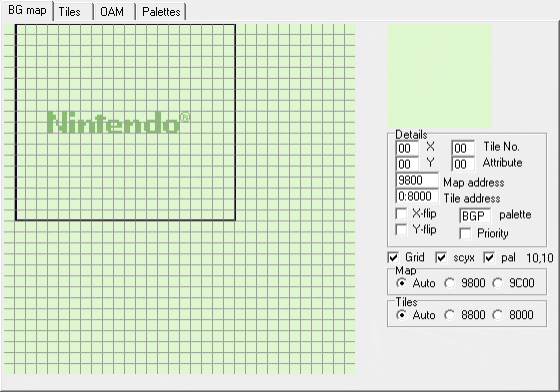

Finally, we'll start to work with animation. The first one will be simple, we're gonna just change the scroll value of the background.

### BG Scrolling

On the previous codes, I just had to copy the desired sprites to memory and start an infinite loop.

Unlike them, now I had to make something inside the main loop.
In this case, I increased the background horizontal position (X pos) after a small delay, which is enough to create a scrolling animation.

Background scroll is saved on addresses `$FF42` (scroll Y) and `$FF43` (scroll X). When it exceeds the limit of the screen, it warps to the other side. Thus, we just need to increment the value of `$FF43` indefinitely.

*Note that incrementing the background scroll value moves it to the right. Since we are "moving" the background to the right, the resulting effect is that the sprites appears to move to the left side, as we can see in the VRAM image below.*

