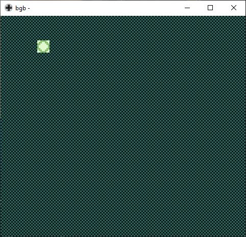
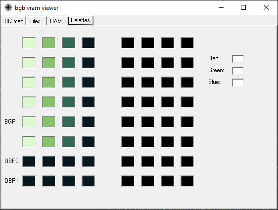
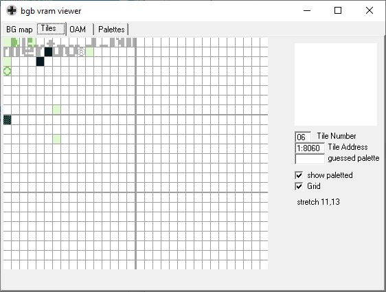
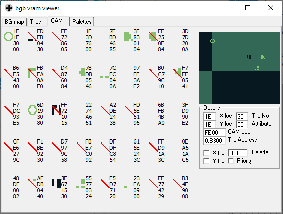
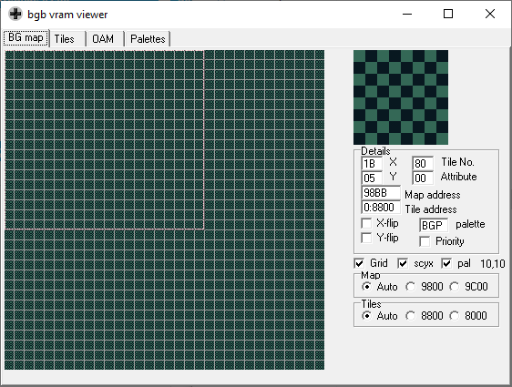
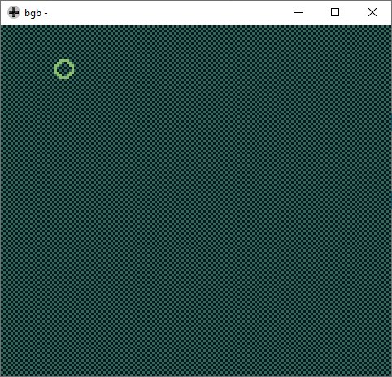
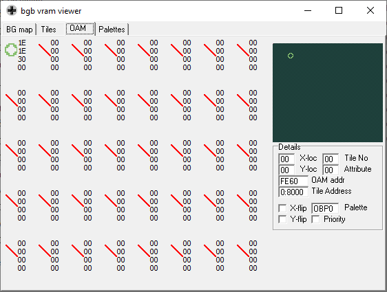

### Sprite as a tile

When we use background tiles to show a sprite on the screen, there is no transparency.

| Screen | VRAM | OAM | Background Map | Palette |
| :---: | :---: | :---: | :---: | :---: |
|  |  |  |  |  |

### Sprite on screen

To solve this problem, the sprite should be in the OAM (Object Attribute Memory a.k.a [Sprite Attribute Memory](https://gbdev.io/pandocs/Accessing_VRAM_and_OAM.html)).
In this case, one of the colors will be treated as a transparent value.

| Screen | VRAM | OAM | Background Map | Palette |
| :---: | :---: | :---: | :---: | :---: |
|  |  |  |  |  |

### Clear OAM

However, when using the OAM some garbage can appear on the screen.
Therefore, we should clear the OAM before drawing the sprites.

| Screen | VRAM | OAM | Background Map |
| :---: | :---: | :---: | :---: |
|  |  |  |  |
