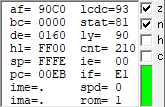
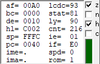

In all codes until now, the CPU was processing everything at all times. This leads to 100% usage, as shown below.

However, when the user is not pressing any button, the CPU could be idle to save power. How to deal with idling in code?
The Game Boy has a way to do this with its halt instruction. When a halt is called, the CPU stops everything. Now, the question is how to get out of the halt and start the process again when a button is pressed?

The answer is to use interrupts. When they are enabled, the CPU will move out from a halt state after an interrupt occurs.

Here we adopt the following strategy:
1. First, halt the process at the start of the main loop;
2. When a vblank occurs, emit an interrupt signal;
3. Check if any button is pressed;
4a. If yes, update the game;
4b. Else, go back to 1.

Using halt saves a lot of CPU power, in a real game boy, this means saving a lot of batteries.
As we can see below, when idle, there is no power consumption.

